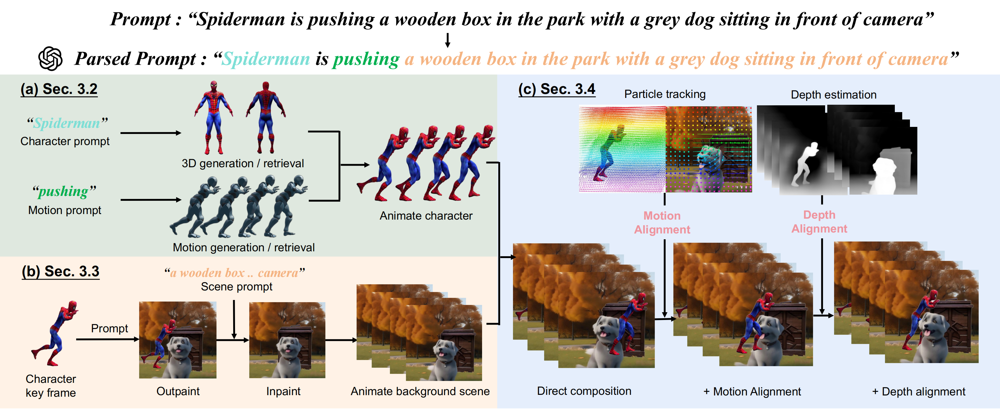

# Co-dreamer: Consistent Video Generation with Animated Characters and Interactive Scenes

#####  
 Yukai Shi, Jianan Wang, Bohan Li, Xili Dai, Bojia Zi, Lei Zhang

### 
The Overall Pipeline of Co-dreamer

</img>

### 
Comparison with Baseline Methods

<video controls>
    <source src="video/baseline_comparison.mp4" type="video/mp4">
    </video>

### 
Interaction Relationships

<video width="320" height="240" controls>
    <source src="video/depth_motion_alignment.mp4" type="video/mp4">
    </video>

<!-- #### 
[Project Page](https://toss3d.github.io/) | [ArXiv](https://arxiv.org/abs/2310.10644) |  [Video]()
 -->

<!-- 
 Our code is coming soon
 -->